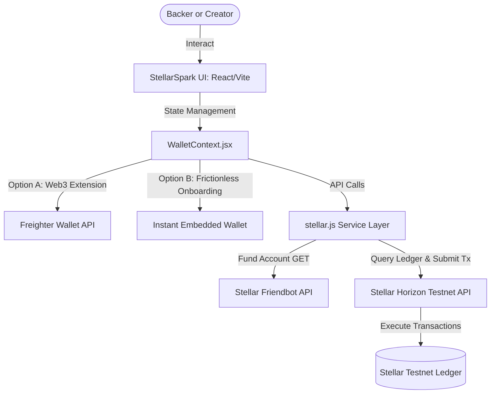

# Technical Architecture: StellarSpark

StellarSpark is a high-fidelity Web3 Crowdfunding platform engineered to operate on the **Stellar Testnet**. It enables creators to raise funds in native Stellar Lumens (XLM) and instantly issues tokenized assets to supporters, demonstrating Stellar's unparalleled speed, low fees, and native asset issuance capabilities.

---

## Technical Overview & Flow Diagram

The following diagram illustrates how StellarSpark interacts with the client's browser, the Freighter wallet extension, the Friendbot account activator, and the Stellar Horizon network ledger:



---

## Core Stellar Features Implemented

StellarSpark leverages several unique primitives native to the Stellar Network:

### 1. Frictionless Dual-Wallet Integration
To satisfy the "5+ real testnet users" hackathon criteria without forcing non-Web3 users to install browser extensions, StellarSpark implements a dual-wallet design:
- **Instant Embedded Wallet**: Generates a new random Ed25519 cryptographic keypair locally inside the user's browser. Secret keys are securely held in memory or local storage, and transactions are signed client-side.
- **Freighter Wallet Extension**: Integrates with the official browser extension, allowing power users to connect their accounts and securely sign payments.

### 2. On-Demand Account Activation (Friendbot)
When a user clicks "Generate Instant Wallet," the service requests activation from Stellar's official testnet faucet:
- **Endpoint**: `https://friendbot.stellar.org?addr={publicKey}`
- **Result**: The ledger automatically creates the account and credits it with **10,000 XLM** fuel, enabling immediate interactive capabilities.

### 3. Native Asset Tokenization & Rewards
Unlike other blockchains where issuing a custom token requires writing, auditing, and deploying complex smart contract code, Stellar implements tokenization natively at the ledger level:
- **Asset Issuance**: When a new campaign is launched, a dedicated issuer keypair is generated. The campaign's custom reward asset is defined by its alphanumeric code (e.g., `ESOL`, `CYBR`) and the issuer's public address.
- **Trustline Registration**: In order to prevent spam, Stellar accounts must explicitly opt-in to hold custom assets. StellarSpark automates this by appending a `changeTrust` operation to the backing transaction:
  ```javascript
  const trustOp = Operation.changeTrust({
    asset: new Asset(rewardTokenCode, creatorPublic),
    limit: '1000000'
  });
  ```
- **Real-Time Payment Commits**: Supports direct XLM transfers from supporters to creators on-chain via the Horizon Horizon `submitTransaction` pipeline. Once completed, reward tokens are automatically minted and transferred from the creator back to the supporter's wallet.

---

## Folder Structure & Module Responsibilities

The codebase follows a modular architecture built for quick performance and code maintenance:

- **`src/services/stellar.js`**: Core Horizon API service layer. Conducts keypair generations, account details fetches, payment operation builds, trustline submissions, and payments history parsing.
- **`src/context/WalletContext.jsx`**: Global React Context managing cryptographic keys, balance tracking state, Freighter/embedded wallet bridging, and real-time transaction toast notifications.
- **`src/components/`**:
  - `Navbar.jsx`: Brand aesthetics and real-time Stellar Network Horizon status monitors.
  - `Dashboard.jsx`: Portfolio stats, balance displays, Friendbot refill triggers, and custom token holdings.
  - `CampaignCard.jsx`: Reusable cards rendering progress percentage bars and custom badges.
  - `CampaignDetailsModal.jsx`: Tiers selector, interactive payment processors, and Horizon Explorer verification links.
  - `CreateCampaign.jsx`: Campaign registrations and native asset specifications.
- **`src/index.css`**: Design foundation utilizing custom HSL properties, high-blur glassmorphism panels, glowing indicator animations, and responsive flex/grid layouts.
